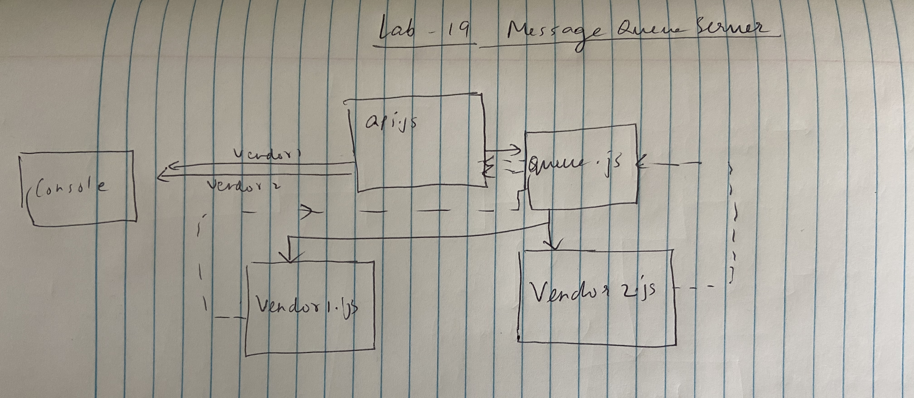

# Lab18-Message Queues

## Message Queues

### Author: Shubham Majumdar

### Links and Resources
* [submission PR](https://github.com/Shubham-401n16/Lab19-MessageQueues/pull/1)
* [Github Actions]

#### Documentation
* [api docs](http://xyz.com/api-docs) (API servers)
* JSDoc Comment Required for all modules and functions in all .js files

### Setup
#### `.env` requirements (where applicable)
* `PORT` -
* `MONGODB_URI` -

#### How to initialize/run your server app (where applicable)
* `npm start`
* npm init
* npm i express socket.io socket.io-client cors morgan
* node api.js
  
#### Tests
* How do you run tests?
npm test

#### UML

